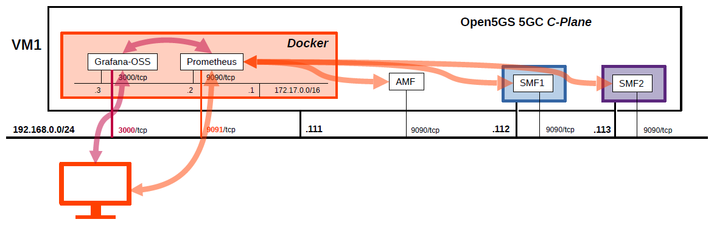
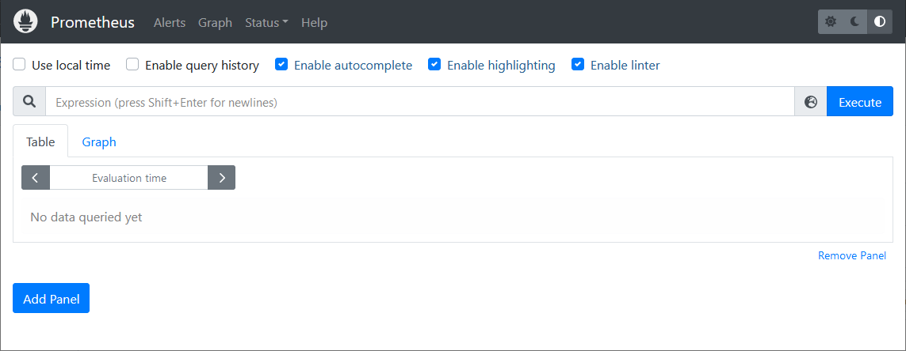
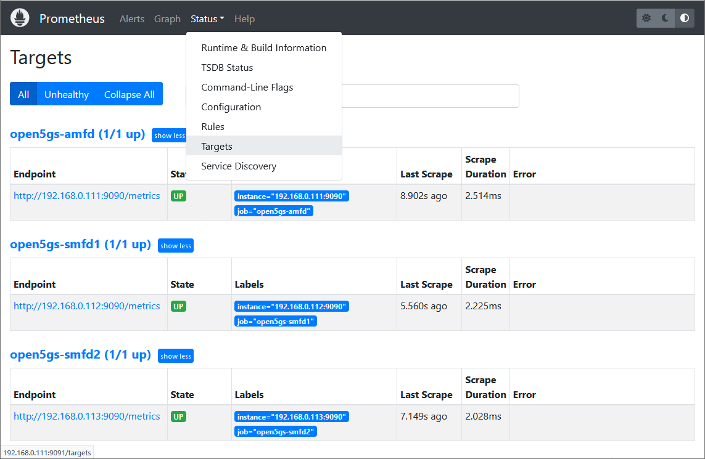
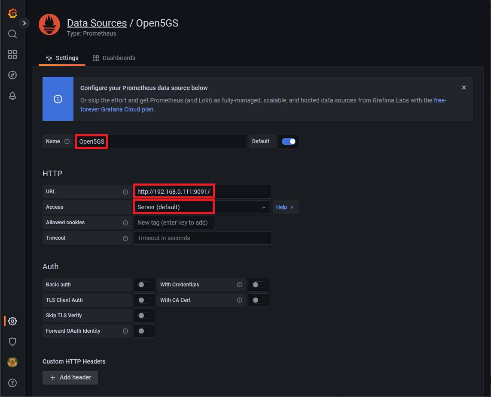
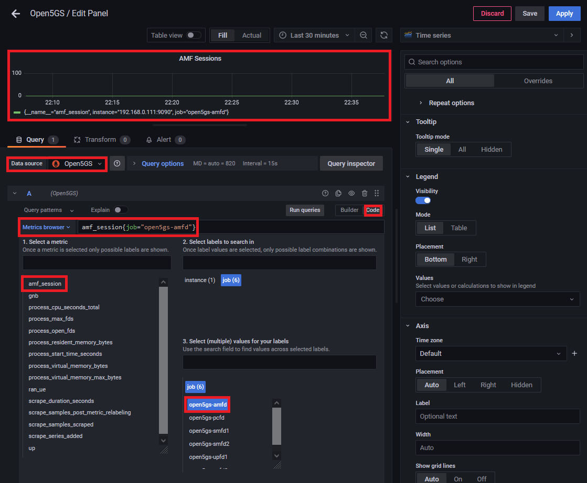

# Open5GS 5GC & UERANSIM UE / RAN Sample Configuration - Monitoring Metrics with Prometheus
This describes a very simple configuration that uses Open5GS and UERANSIM for monitoring the metrics with Prometheus.
The metrics are as of 2022.08.07. I think the new metrics will be added in the future.

---

<h2 id="conf_list">List of Sample Configurations</h2>

1. [One SGW-C/PGW-C, Multiple SGW-Us/PGW-Us and APNs](https://github.com/s5uishida/open5gs_epc_oai_sample_config)
2. [One SMF, Multiple UPFs and DNNs](https://github.com/s5uishida/open5gs_5gc_ueransim_sample_config)
3. [Select nearby UPF according to the connected gNodeB](https://github.com/s5uishida/open5gs_5gc_ueransim_nearby_upf_sample_config)
4. [Select UPF based on S-NSSAI](https://github.com/s5uishida/open5gs_5gc_ueransim_snssai_upf_sample_config)
5. [SCP Indirect communication Model C](https://github.com/s5uishida/open5gs_5gc_ueransim_scp_model_c_sample_config)
6. [VoLTE and SMS Configuration for docker_open5gs](https://github.com/s5uishida/docker_open5gs_volte_sms_config)
7. Monitoring Metrics with Prometheus (this article)

---

<h2 id="toc">Table of Contents</h2>

- [Overview of Open5GS 5GC Simulation Mobile Network](#overview)
- [Additional changes in configuration files of Open5GS 5GC C-Plane](#changes_cp)
- [Build Open5GS for using Prometheus](#build)
- [Run Prometheus](#run_prometheus)
  - [Web Access to Prometheus Dashboard](#access_prometheus)
  - [Metrics of Open5GS AMF](#amf_metrics)
  - [Metrics of Open5GS SMF](#smf_metrics)
- [Run Grafana](#run_grafana)
  - [Web Access to Grafana Dashboard](#access_grafana)
  - [Prometheus data source](#data_source)
  - [Example of setting visualization of metrics](#set_metric)
- [Changelog (summary)](#changelog)

---
<h2 id="overview">Overview of Open5GS 5GC Simulation Mobile Network</h2>

This is an additional setting example when monitoring the metrics with Prometheus for the following sample configuration.

- [Open5GS 5GC & UERANSIM UE / RAN Sample Configuration - Select UPF based on S-NSSAI](https://github.com/s5uishida/open5gs_5gc_ueransim_snssai_upf_sample_config)

This example configuration for monitoring metrics with Prometheus is shown in the figure below.
NFs without metrics are not drawn in the figure.

</img>

The 5GC / UE / RAN used are as follows.
Also, I started Prometheus and Grafana using Docker.
- 5GC - Open5GS v2.4.9 - https://github.com/open5gs/open5gs
- UE / RAN - UERANSIM v3.2.6 - https://github.com/aligungr/UERANSIM

The IP address and port of the monitored NFs are as follows.
| NF | IP address | port | Prometheus job_name |
| --- | --- | --- | --- |
| AMF | 192.168.0.111 | 9090/tcp | open5gs-amfd |
| SMF1 | 192.168.0.112 | 9090/tcp | open5gs-smfd1 |
| SMF2 | 192.168.0.113 | 9090/tcp | open5gs-smfd2 |

The exposed IP address and port of Prometheus and Grafana-OSS are as follows.
| Server | IP address | port |
| --- | --- | --- |
| Prometheus |  192.168.0.111 | 9091/tcp |
| Grafana-OSS |  192.168.0.111 | 3000/tcp |

<h2 id="changes_cp">Additional changes in configuration files of Open5GS 5GC C-Plane</h2>

In this case, the following configuration is further changed for monitoring the metrics with Prometheus.

- [Open5GS 5GC & UERANSIM UE / RAN Sample Configuration - Select UPF based on S-NSSAI](https://github.com/s5uishida/open5gs_5gc_ueransim_snssai_upf_sample_config)

I will explain what to set additionally here.
When monitoring the metrics with Prometheus, change the following configuration files for each NF of C-Plane.
- `open5gs/install/etc/open5gs/amf.yaml`
```
...
metrics:
    addr: 192.168.0.111
    port: 9090
```
- `open5gs/install/etc/open5gs/smf1.yaml`
```
...
metrics:
    addr: 192.168.0.112
    port: 9090
```
- `open5gs/install/etc/open5gs/smf2.yaml`
```
...
metrics:
    addr: 192.168.0.113
    port: 9090
```

<h2 id="build">Build Open5GS for using Prometheus</h2>

**Note. On 2022.11.21, Open5GS now builds to set Prometheus metrics by default.**

Please refer to the following for building Open5GS for using Prometheus.
- https://open5gs.org/open5gs/docs/guide/02-building-open5gs-from-sources/
- https://open5gs.org/open5gs/docs/tutorial/04-metrics-prometheus/

In addition, please install `cmake` as well.
```
apt update
apt install cmake
```

Please install the following to run Prometheus on Docker.
- [docker-ce](https://docs.docker.com/install/linux/docker-ce/ubuntu)

**I will explain a few notes when building on Ubuntu 20.04.**

**1. Change the build procedure slightly as follows.**

```
cd open5gs
meson build --prefix=`pwd`/install
ninja -C build
```
Change the above to run as follows.
```
cd open5gs
meson build --prefix=`pwd`/install && meson configure -Dmetrics_impl=prometheus build
ln -s `pwd`/subprojects/ `pwd`/../subprojects
ninja -C build
```

**2. After building and installing, if the shared library `libcm_prom.so` is not found in the following NFs, please follow the steps below.**
```
open5gs-amfd
open5gs-smfd
```
To link `libcm_prom.so`, do the following.
```
cd open5gs
cp -p install/lib/libcm_prom.so install/lib/x86_64-linux-gnu/
```
If these NFs still can't link, try the following.
```
cd open5gs
echo `pwd`/install/lib/x86_64-linux-gnu >> /etc/ld.so.conf.d/open5gs.conf
ldconfig
```

<h2 id="run_prometheus">Run Prometheus</h2>

Please refer to the following for using Prometheus.
- https://open5gs.org/open5gs/docs/tutorial/04-metrics-prometheus/

<h3 id="access_prometheus">Web Access to Prometheus Dashboard</h3>

First, create the following `prometheus.yml`.
```yaml
global:
  scrape_interval: 10s

scrape_configs:
  - job_name: open5gs-amfd
    static_configs:
      - targets: ["192.168.0.111:9090"]
  - job_name: open5gs-smfd1
    static_configs:
      - targets: ["192.168.0.112:9090"]
  - job_name: open5gs-smfd2
    static_configs:
      - targets: ["192.168.0.113:9090"]
```
After starting Open5GS, run Prometheus as follows.
```
docker run -d -p 9091:9090 -v `pwd`/prometheus.yml:/etc/prometheus/prometheus.yml prom/prometheus
```
You can access the following URL with web browser.
```
http://192.168.0.111:9091/
```

</img>

The list of targets is as follows.

</img>

<h3 id="amf_metrics">Metrics of Open5GS AMF</h3>

Following the Endpoint link of job_name=**open5gs-amfd**, the metrics will be displayed as follows.
```sh
# HELP ran_ue RAN UEs
# TYPE ran_ue gauge
ran_ue 0

# HELP amf_session AMF Sessions
# TYPE amf_session gauge
amf_session 0

# HELP gnb gNodeBs
# TYPE gnb gauge
gnb 0

# HELP process_max_fds Maximum number of open file descriptors.
# TYPE process_max_fds gauge
process_max_fds 1024

# HELP process_virtual_memory_max_bytes Maximum amount of virtual memory available in bytes.
# TYPE process_virtual_memory_max_bytes gauge
process_virtual_memory_max_bytes -1

# HELP process_cpu_seconds_total Total user and system CPU time spent in seconds.
# TYPE process_cpu_seconds_total gauge
process_cpu_seconds_total 3

# HELP process_virtual_memory_bytes Virtual memory size in bytes.
# TYPE process_virtual_memory_bytes gauge
process_virtual_memory_bytes 152248320

# HELP process_resident_memory_bytes Resident memory size in bytes.
# TYPE process_resident_memory_bytes gauge
process_resident_memory_bytes 19255296

# HELP process_start_time_seconds Start time of the process since unix epoch in seconds.
# TYPE process_start_time_seconds gauge
process_start_time_seconds 515230

# HELP process_open_fds Number of open file descriptors.
# TYPE process_open_fds gauge
process_open_fds 24
```
<h3 id="smf_metrics">Metrics of Open5GS SMF</h3>

Following the Endpoint link of job_name=**open5gs-smfd1**, the metrics will be displayed as follows.
```sh
# HELP gn_rx_createpdpcontextreq Received GTPv1C CreatePDPContextRequest messages
# TYPE gn_rx_createpdpcontextreq counter
gn_rx_createpdpcontextreq 0

# HELP gn_rx_deletepdpcontextreq Received GTPv1C DeletePDPContextRequest messages
# TYPE gn_rx_deletepdpcontextreq counter
gn_rx_deletepdpcontextreq 0

# HELP gtp1_pdpctxs_active Active GTPv1 PDP Contexts (GGSN)
# TYPE gtp1_pdpctxs_active gauge
gtp1_pdpctxs_active 0

# HELP ues_active Active User Equipments
# TYPE ues_active gauge
ues_active 0

# HELP gtp2_sessions_active Active GTPv2 Sessions (PGW)
# TYPE gtp2_sessions_active gauge
gtp2_sessions_active 0

# HELP gtp_node_gn_rx_parse_failed Received GTPv1C messages discarded due to parsing failure
# TYPE gtp_node_gn_rx_parse_failed counter

# HELP s5c_rx_createsession Received GTPv2C CreateSessionRequest messages
# TYPE s5c_rx_createsession counter
s5c_rx_createsession 0

# HELP s5c_rx_deletesession Received GTPv2C DeleteSessionRequest messages
# TYPE s5c_rx_deletesession counter
s5c_rx_deletesession 0

# HELP gtp_new_node_failed Unable to allocate new GTP (peer) Node
# TYPE gtp_new_node_failed counter
gtp_new_node_failed 0

# HELP s5c_rx_parse_failed Received GTPv2C messages discarded due to parsing failure
# TYPE s5c_rx_parse_failed counter
s5c_rx_parse_failed 0

# HELP sessions_active Active Sessions
# TYPE sessions_active gauge
sessions_active 0

# HELP gtp_node_gn_rx_createpdpcontextreq Received GTPv1C CreatePDPContextRequest messages
# TYPE gtp_node_gn_rx_createpdpcontextreq counter

# HELP gtp_node_gn_rx_deletepdpcontextreq Received GTPv1C DeletePDPContextRequest messages
# TYPE gtp_node_gn_rx_deletepdpcontextreq counter

# HELP bearers_active Active Bearers
# TYPE bearers_active gauge
bearers_active 0

# HELP gn_rx_parse_failed Received GTPv1C messages discarded due to parsing failure
# TYPE gn_rx_parse_failed counter
gn_rx_parse_failed 0

# HELP gtp_node_s5c_rx_parse_failed Received GTPv2C messages discarded due to parsing failure
# TYPE gtp_node_s5c_rx_parse_failed counter

# HELP gtp_peers_active Active GTP peers
# TYPE gtp_peers_active gauge
gtp_peers_active 0

# HELP gtp_node_s5c_rx_createsession Received GTPv2C CreateSessionRequest messages
# TYPE gtp_node_s5c_rx_createsession counter

# HELP gtp_node_s5c_rx_deletesession Received GTPv2C DeleteSessionRequest messages
# TYPE gtp_node_s5c_rx_deletesession counter

# HELP process_max_fds Maximum number of open file descriptors.
# TYPE process_max_fds gauge
process_max_fds 1024

# HELP process_virtual_memory_max_bytes Maximum amount of virtual memory available in bytes.
# TYPE process_virtual_memory_max_bytes gauge
process_virtual_memory_max_bytes -1

# HELP process_cpu_seconds_total Total user and system CPU time spent in seconds.
# TYPE process_cpu_seconds_total gauge
process_cpu_seconds_total 7

# HELP process_virtual_memory_bytes Virtual memory size in bytes.
# TYPE process_virtual_memory_bytes gauge
process_virtual_memory_bytes 1169731584

# HELP process_resident_memory_bytes Resident memory size in bytes.
# TYPE process_resident_memory_bytes gauge
process_resident_memory_bytes 45481984

# HELP process_start_time_seconds Start time of the process since unix epoch in seconds.
# TYPE process_start_time_seconds gauge
process_start_time_seconds 515230

# HELP process_open_fds Number of open file descriptors.
# TYPE process_open_fds gauge
process_open_fds 21
```

<h2 id="run_grafana">Run Grafana</h2>

I used the OSS version of Grafana.

<h3 id="access_grafana">Web Access to Grafana Dashboard</h3>

After starting Open5GS and Prometheus, run Grafana-OSS as follows.
```
docker run -d -p 3000:3000 grafana/grafana-oss
```
You can access the following URL with web browser.
The default username and password are both `admin`.
```
http://192.168.0.111:3000/
```

<h3 id="data_source">Prometheus data source</h3>

The data source name, URL, and access mode are as follows.
I used the defaults for other than these as is.
| Name | URL | Access Mode |
| --- | --- | --- |
| Open5GS | `http://192.168.0.111:9091/` | Server |

</img>

<h3 id="set_metric">Example of setting visualization of metrics</h3>

Create your first dashboard and a panel for each metric you want to visualize.
In the `Metrics browser`, select the job and its metrics to visualize from the three job_names, set panel properties, add panels, and create the dashboard.

The following is a simple example of setting the panel for the AMF metric `amf_session`.

</img>

Grafana allows you to freely design user-friendly dashboards by creating attractive panels for each metric and combining them.

---
I was able to confirm the very simple configuration that uses Open5GS and UERANSIM for monitoring the metrics with Prometheus.
Also, when using Open5GS as EPC, MME(`open5gs-mmed`) supports Prometheus metrics, so you can monitor these metrics by making similar settings.
I would like to thank the excellent developers and all the contributors of Open5GS, UERANSIM, Prometheus and Grafana.

<h2 id="changelog">Changelog (summary)</h2>

- [2022.08.07] Initial release.
